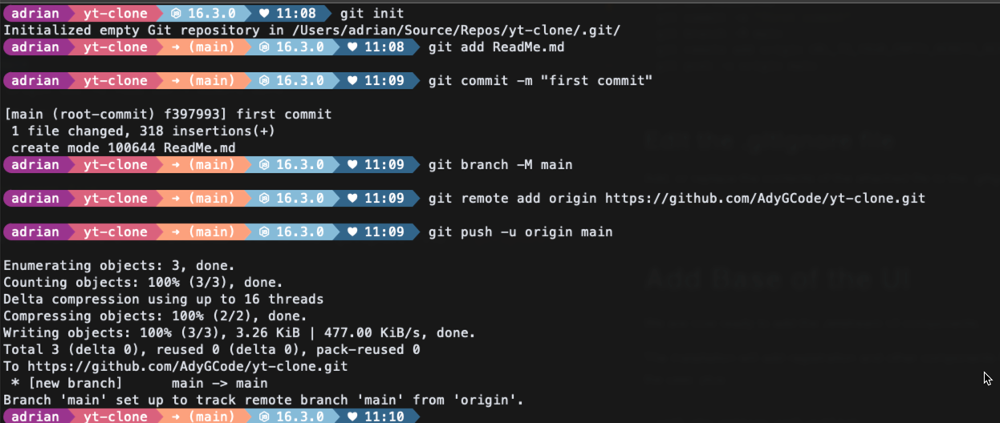
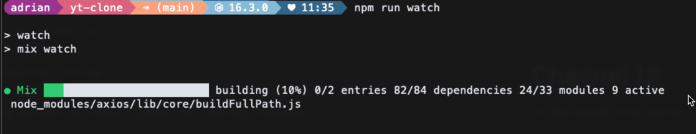
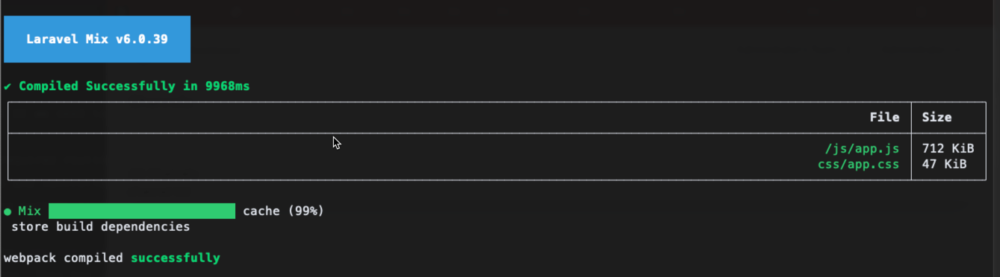
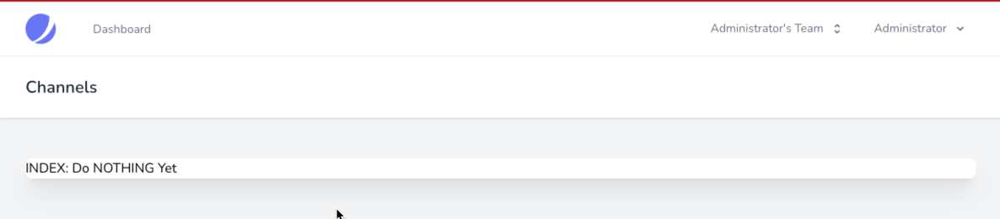
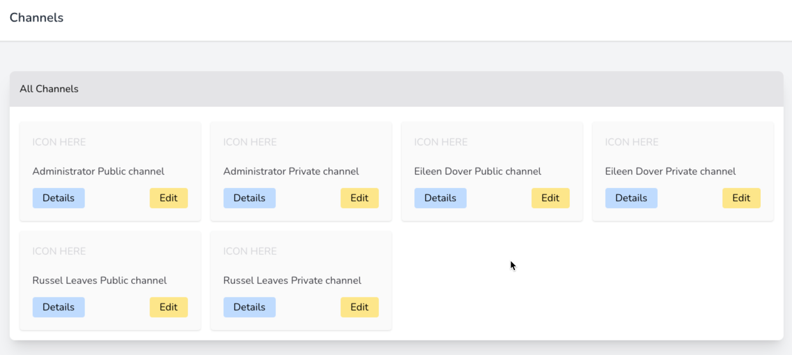
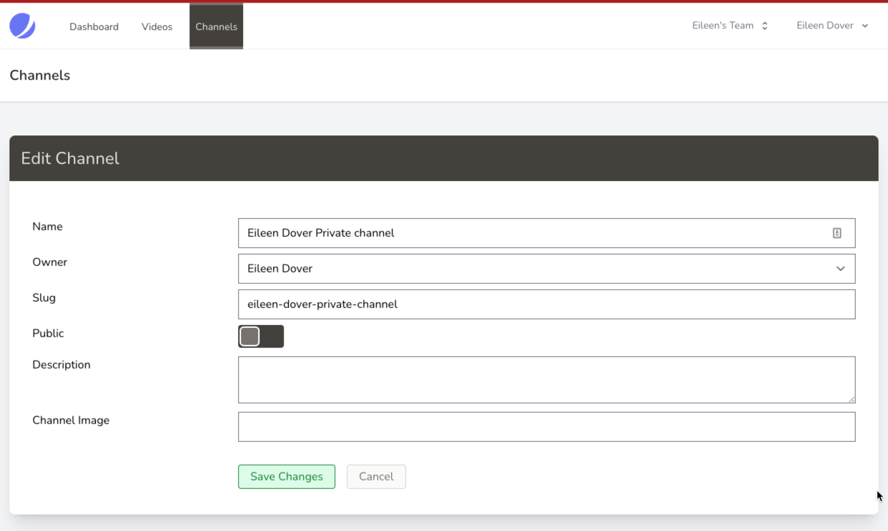
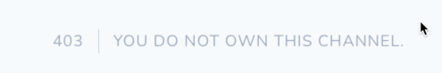
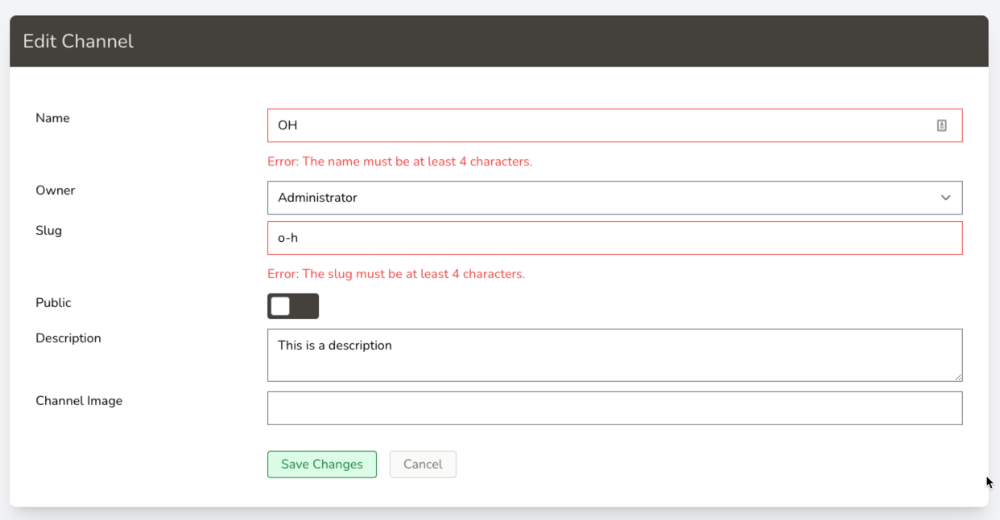
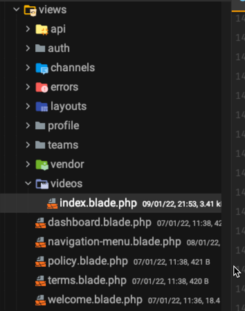

# n-Tube Type Clone

**This is a work in progress (WIP) and will regularly be updated.**

This document has the command "sail" used heavily. This is because
development was completed using a Docker based dev environment that is
part of the Laravel installation. This may be omitted if you are not
using Docker in your development process.

---

# 1. Create new app

For all commands where `xxx` is shown, replace with your initials.

```shell
curl -s https://laravel.build/xxx-yt-clone | bash 
cd xxx-yt-clone 
sail up
```

---

## Initialise Version Control

We do this in two steps:

1. Create remote repository on GitHub or similar
2. Initialise the local repository, add and commit the ReadMe (this
   file), set the origin and then push to the remote we created.

### Create Remote Repository

Open the [GitHub website](http://github.com) and log into your account.

In the account create a new repository, but ensure the following:

- Do NOT add a readme or .gitignore or other files
- Make the project private if required
- Give the repository a suitable name (I used `totally-blank` in the
  demo image)

Keep the browser open as you are then able to copy the URL and commands
as needed.


### Terminal time

Open a second terminal so that we may initialise the Repository.

> We usually need TWO terminals when developing, so if you have one
> open, open a new one and make sure you are in your xxx-yt-clone folder
> before continuing.

Then run the following command sequence.

```shell
git init
git add ReadMe.md
git commit -m "Initial commit to start repository"
git branch -M main
git remote add origin URL_TO_YOUR_EMPTY_REMOTE_REPO
git push -u origin main
```



### Updating and Committing the .gitignore

Add, or replace the contents of the attached file to the .gitignore
file: [.gitignore](.gitignore)

```shell
git add .gitignore
git commit -m "Update the .gitignore to remove unwanted files"
git push -u origin main
```

---

# 2. Add UI Skeleton Code

We are now ready to add the Jetstream UI components...

The installation will add registration and other components for the
user, and more ...

```shell
sail php artisan sail:publish
sail composer require laravel/jetstream
sail php artisan jetstream:install livewire --teams 

sail npm install 
sail npm run dev
sail php artisan migrate:fresh --seed
sail php artisan vendor:publish --tag=laravel-mail --tag=laravel-errors 
sail php artisan vendor:publish --tag=sail --tag=jetstream-views --tag=livewire 
sail php artisan vendor:publish --tag=livewire:assets --tag=livewire:config 
sail php artisan vendor:publish --tag=livewire:pagination --tag=sanctum-config
```

These commands also add Laravel Livewire, and then publish the
components and some configuration files so that you can directly access
and edit or customise as required.

> **Note:** The use of Jetstream does not mean we cannot use blade
> templates, so we are good to go.

## IDE Helpers

Now to add a couple of helpers for PhpStorm (possibly other IDEs)...
plus a debugging bar (shown on the browser) whilst we are developing.

```shell
sail composer require --dev barryvdh/laravel-ide-helper barryvdh/laravel-debugbar
sail php artisan clear-compiled
sail php artisan ide-helper:generate
sail php artisan ide-helper:models -W
sail php artisan ide-helper:meta
```

Open the `composer.json` file, and add/modify an entry to the `scripts`
area. If the `post-update-cmd` is already present then add the lines
between the `[`square brackets`]`.

```text
"post-update-cmd": [
  "Illuminate\\Foundation\\ComposerScripts::postUpdate",
  "@php artisan vendor:publish --tag=laravel-assets --ansi --force",
  "@php artisan ide-helper:generate",
  "@php artisan ide-helper:models -W",
  "@php artisan ide-helper:meta"
],
```

### Do a Commit and Push to Version Control

Do the usual sequence of adding and pushing to version control, with a
suitable comment:

```shell
git add .
git commit -m "Default configuration without seed users"
git push -u origin main
```

---

# 3. Create Model for Channel

This command also creates a migration, factory, seeder, controller and
policy for the Channels.

```shell
sail php artisan make:model Channel -a -r
```

Go to the `database/migrations` folder and open the file that
contains `create_channels_table.php` in its filename.

Modify/Add the following code:

```PHP
Schema::create('channels', function (Blueprint $table) {
    $table->id();
    $table->unsignedBigInteger('user_id');
    $table->string('name');
    $table->string('slug');
    $table->boolean('private')->default(false);
    $table->string('uid');
    $table->text('description')->nullable();
    $table->string('image')->nullable();
    $table->timestamps();

});
```

## Relating the video to the channel:

Immediately after the timestamps line, and before the closing `}` of the
up method, we can relate the video table to it's owning channel using a
foreign key constraint:

```php
$table->foreign('user_id')->references('id')->on('users')
    ->onDelete('cascade')->onUpdate('cascade');
```

The above line(s) should go after the `timestamps` line, and before the
closing `});`.

What do these line(s) do?

They relate the 'channels' table to the 'users' table. The relationship
is interpreted this way:

- `foreign('user_id')` is the field/column in this table that relates to
  another table.
- `reference('id')` is the primary key field in the second table.
- `on('users')` is the table we are relating to.
- `onDelete('cascade')` - tells the DBMS that when a record in the
  related table (`users` in our case) is deleted, then all the channels
  that use has must be deleted.

We now are able to add relationships to the Model to make it easy for
use to follow the relationship from table to table.

### Defining 'fillable' fields and 'relationships'

Now open the model file for the channel, `Channel.php` that is in
the `app/Models` folder.

Edit it to define the editable fields, and also the relationship between
channel and user.

Add the following code inside the class definition, and after
the `use HasFactory;` line:

```php
    protected $fillable = [
        'name',
        'description',
        'image',
        'public',
        'slug',
        'uid',
        'user_id',
    ];

    /**
     * A channel BELONGS TO a user.
     *
     * @return \Illuminate\Database\Eloquent\Relations\HasMany
     */
    public function user()
    {
        return $this->belongsTo(User::class);
    }
```

The fillable fields are those that the application will allow to be
altered directly by inserts, deletes and updates.

The `users()` method defines how this table relates to the 'users'
table.

In this case a channel will belong to a user.

### Adding a relationship to the User model

Edit the `User.php` file from the same folder and add the following
relationship definition within the class, and after the `$casts`
definition:

```php
    /**
     * A user has MANY channels
     *
     * @return \Illuminate\Database\Eloquent\Relations\HasMany
     */
    public function channels(){
        return $this->hasMany(Channel::class);
    }
```

This indicates that a user may have many channels.

```text
+-------+                     +----------+
| users | <-- 1 ------- m --> | channels |
+-------+                     +----------+
```

Now run the migration again:

```shell
sail php artisan migrate:fresh --seed
```

## Using the Channel's 'slug'

When a user registers, we want the application to automatically create
them a channel based around the user's name.

The channel name will be similar to this: `Eileen Dover Public Channel`.

It will have a 'slug' that will be similar to
`eileen-dover-public-channel`.

This slug will be used to identify the required channel when using a URL
similar to
`http://yt-clone.com/channels/eileen-dover-public-channel`.

To get the slug to be used for 'routing' we need to edit the Channel
model and add the following before the `public function user` line:

```php
    /**
     * Provides the key name for the routes to be the slug in place of the commonly used 'id'.
     *
     * @return string
     */
    public function getRouteKeyName()
    {
        return 'slug';
    }
```

## Time to commit to this

OK, we have made some large changes in the code, so we will commit them
to version control.

Perform the usual steps:

- add files to the staging area
- check the status of files in the staging area
- commit the changes to the repository
- push the changes to the remote repository

```shell
git add .
git status
git commit -m "Base application plus Channel model and migration"
git push origin main
```

---

# 4. Add Seeder Data

To enable interactive testing, we will add some seed data that we can
repeatedly use.

## User Seeder

Run the command:

```shell
sail php artisan make:seeder UserSeeder
```

Now find and open the new file in the `database/seeders` folder.

In the run method we are going to do two things:

1. Add required 'uses' statements
2. Create a list of known seed users,
3. Create the new user.
4. Create public and private channels for each user.
5. Create a 'team' for each user.

### Include Required Classes

Before we add the users, we will add the required `use` statements:

```php
use App\Models\Channel;
use App\Models\User;
use Illuminate\Database\Seeder;
use Illuminate\Support\Facades\Hash;
use App\Models\Team;
use Str;
```

We will be making use of these when we seed.

> **IMPORTANT:** One of the most common errors in using a framework
> such as Laravel is forgetting to include the required classes when
> they are used.
>
> The next issue you will encounter is selecting the
> correct class to include. All frameworks have their own ideas and
> structures and idiosyncrasies that take time to get used to, and
> even then they throw a curveball from time to time.

### Define Users

The seed users are:

```text
|---------------|--------------------|-----------|
| User Name     | eMail              |Password   |
|---------------|--------------------|-----------|
| Administrator | admin@example.com  | Password1 |
| Eileen Dover  | eileen@example.com | Password1 |
| Russel Leaves | russel@example.com | Password1 |
| YOUR NAME     | GIVEN@example.com  | Password1 |
|---------------|--------------------|-----------|
```

Replace `YOUR NAME` with your own name, so you have your own entry
point, and `GIVEN` is your given (*first*) name.

These names are added to an array containing associative arrays for each
user.

The PHP to do this is shown below, and you should add it to the run
method:

```php
$seedUsers = [
        [
            'name'=>'Administrator',
            'email'=>'admin@example.com',
            'password'=>Hash::make('Password1'),
        ],
        [
            'name'=>'Eileen Dover',
            'email'=>'eileen@example.com',
            'password'=>Hash::make('Password1'),
        ],
        [
            'name'=>'Russel Leaves',
            'email'=>'russel@example.com',
            'password'=>Hash::make('Password1'),
        ],
        [
            'name'=>'YOUR NAME',
            'email'=>'GIVEN@example.com',
            'password'=>Hash::make('Password1'),
        ],
    ];
```

### Seeding Loop

Next we will create the loop that adds each new user, plus creates the
channel. The code goes immediately after the seed names and before the
closing curly bracket `}` of the run method.

Here is sample code for you:

```php
foreach ($seedUsers as $seedUser) {
    $user = User::create($seedUser);
    $team = $this->createTeam($user);
    foreach (['Public', 'Private'] as $pubOrPrivate) {
        $channelName = implode([$user->name, " ", $pubOrPrivate," channel"]);
        $userChannel = [
            'user_id' => $user->id,
            'name' => $channelName,
            'slug' => Str::slug($channelName, '-'),
            'public'=> $pubOrPrivate==='Public',
            'uid' => uniqid("some-unique-prefix-with-many-characters", true),
            'description' => null,
            'image' => null,
        ];
        Channel::create($userChannel);
    }
}
```

### Create Team method

After the seeding loop and just before the closing `}` curly bracket of
the class we will add the following code, which creates a new personal
team for the user.

> We may or may not use teams later in the project. They could be
> seen as "groups of friends" or "colleagues" or "sections of a
> company" or similar.

The `createTeam` method is given below and is taken from the Laravel
Jetstream code that is generated when the 'module' is installed:

```php
protected function createTeam(User $user)
{
    $user->ownedTeams()->save(
        Team::forceCreate([
              'user_id' => $user->id,
              'name' => explode(' ', $user->name, 2)[0]."'s Team",
              'personal_team' => true,
          ])
    );
}
```

## Channel Seeder

We do not have any seeding to be added at this time to the channels.

## Add Seeder Calls

Open the `DatabaseSeeder.php` file and modify the code so that it runs
the required seeders in turn, starting with User.

The run method becomes:

```php
public function run()
{
    // \App\Models\User::factory(10)->create();
    $this->call([
        UserSeeder::class,
        ChannelSeeder::class,
                ]);
}
```

## Re-Run the Migrations

Now re-run the migration using:

```shell
sail php artisan migrate:fresh --seed
```


### Add, Commit, Push

Let's add the new code to version control.

```shell
git add .
git status
git commit -m "Base application plus Channel model and migration"
git push origin main
```

---

# 5. Channel UI

For the channel UI we need to:

1. Create the required routing.
2. Create views and controller methods for BREAD operations (Browse,
   Read, Edit, Add and Delete).
3. Add remaining methods to Store, Update and Destroy channels.

When we used the `php artisan make:model` command we listed `-a` and
`-r` as arguments. This has automatically created the channel controller
for us, and all we will need to do is now add the required code to
perform the actions.

Because TailwindCSS version 3 now uses a different way of working, it
adds the required classes [Just In Time](https://tailwindcss.
com/blog/just-in-time-the-next-generation-of-tailwind-css), we will need
to run a command in the CLI to watch the project and automatically
update the required files - that is the JS and CSS files.

If you do not have a spare CLI then open up a window, change into the
correct folder, and run:

```shell
npm run watch
```

Leave this running whilst you are working.



When a change is detected it will 'compile' the code, and generate new
files. Success is shown below:



## Adding Routes for Channels

Open the `web.php` file from the `routes` folder.

Modify it by grouping the "authenticated" routes. We do this by adding
and modifying the following route. In this you will note that we move
the dashboard route into the group, and update it to remove the
middleware call.

```php
Route::middleware(['auth:sanctum', 'verified'])->group(function () {
    Route::get('/dashboard', function () {
        return view('dashboard');
    })->name('dashboard');
    
    Route::resource('/channels', \App\Http\Controllers\ChannelController::class);
    
});
```

The middleware is how Laravel checks for authentication, and other
possible actions.

> **ASIDE:** When adding routes, it is a good idea to keep them in
> alphabetical order as it makes it easier to locate them. Also,
> group your authenticated and other types of route together as well.
>
> Performing these forms of actions will help you to improve
> productivity.

## View File Location

Views are contained in the `resources/views` folder.

We place the views for any model that requires them, into a folder in
this location.

Normally the folder is named the same as the pluralised version of the
model name. For example *Channel* becomes
*channels*, and *Sheep* would become *sheep*.

## Channels Views and Controller Methods

- Controllers are found in `app/Http/Controllers`
- Views are contained in `resources/views`

The two components make up a vital part of the MVC architecture that  
Laravel is based upon.

### Channels Controller: Index Method

Before we create the index blade file, we will edit the Channels
controller. Locate the `ChannelsController` in
the `app/Http/Controllers` folder, and open it for editing.

In this file you will find stub methods ready for you to use, such as
the one below:

```php
/**
 * Display a listing of the resource.
 *
 * @return \Illuminate\Http\Response
 */
public function index()
{
    //
}
```

Modify this index method to read:

```php
public function index()
{
    $channels = Channel::all();
    return view('channels.index', compact(['channels']));
}
```

This reads all the channels from the channel data source (via the model)
, and then sends them to the channels index view page (to be added next)
for display.

### Channels Views: Index

To provide us with the first part of our layout, we will create an index
page for the channels, but we will make it display **all** channels,
both public, private and those owned by other users.

At a later time we will make it show just the public channels and the
private channels owned by the user.

Create a new folder inside `resources/views` called `channels`.

Then create aa file called `index.blade.php` inside the
`resources/views/channels` folder.

> **SHORTCUT :** We can create the folder and the file in one step
> by first clicking on the `views` folder, then using the sequence,
> `File -> New -> PHP File`, then entering `channels/index.blade.php`

The file will be blank, so we need to add code to make it do something.

In the new file we will add code based on the 'dashboard', to make it
look similar to the current layout.

```php
<x-app-layout>
    <x-slot name="header">
        <h2 class="font-semibold text-xl text-gray-800 leading-tight">
            {{ __('Channels') }}
        </h2>
    </x-slot>

    <div class="py-12">
        <div class="max-w-7xl mx-auto sm:px-6 lg:px-8">
            <div class="bg-white overflow-hidden shadow-xl sm:rounded-lg">

                <h3 class="text-2xl text-bold text-stone-700 pb-4">
                INDEX: Does NOTHING Yet
                </h3>

            </div>
        </div>
    </div>
</x-app-layout>
```

The `x-app-layout` tells Laravel to use the `layouts/app.blade.php`
template file as the base for this page, and then insert content as
needed.

The `<x-slot name="header">` tells the templating engine to look for a
named location (called 'header') in the main template file and insert
the content inside the "element" at the required location.

### Checking Page Renders

Open the browser, open the site (http://localhost for sail users), and
then log-in using the administrator (or your own) user.

Next, once the user is logged in, edit the URL to be
`http://localhost/channels/` and you should see:



### Actually Displaying the Channels

Next we will update the view so that it lists the channels.

We will edit the section after the `All Channels` and the `</div>`
by adding the `foreach` that will process each channel in turn:

```php
<div class="container mx-auto grid lg:grid-cols-3 xl:grid-cols-4 p-4 gap-4">

    @foreach($channels as $channel)
        <div class="rounded border-1 shadow">
            <div class="p-4 sm:p-5">
                <p tabindex="0"
                   class="focus:outline-none text-base leading-5 pt-6 text-stone-700">
                   {{$channel->name}}
                </p>
                <div class="flex items-center justify-between pt-4">
                    <a href="#" class="rounded p-1 px-4 bg-blue-200 hover:bg-blue-500"
                       role="button">
                       Details
                    </a>

                    <a href="#" class="rounded p-1 px-4 bg-amber-200 hover:bg-amber-500"
                       role="button">
                       Edit
                    </a>
                </div>
            </div>
        </div>
    @endforeach

</div>
```

You should get a list of the channels shown a little cards. It will
appear slightly different to shown here:



We will modify the edit and details buttons later.

### Commit!

This would be a good point to add, commit and push your code.

## Edit

As with the index, we need to add the required code to the Channel
Controller, and create a View. We also need to update the Update Channel
Request and Channel Policy settings.

### ChannelController update and edit methods

The Channel Controller will have two methods updated/created:

- edit and
- update.

The edit retrieves the channel details by using Route Model Binding, and
displays the `edit.blade.php` file to allow the user to edit the
channel's details. When the user submits the changes, the view sends the
request to the site, and the router then calls the required `update`
method in the channel controller to perform the changes.

### Edit Method

Locate the `edit` method in the `ChannelsController` and modify to
become:

```php
public function edit(Channel $channel)
{
    $users = User::all(['id','name']);
    return view('channels.edit', compact(['channel', 'users']));
}
```

This method will open the channels/edit view
(`resources/views/channels/edit.blade.php`) sending a list of the users
and the channel details to the view for display, and the user to edit.

Note that we only ask Laravel to give us the User's name and id:

```php
$users = User::all(['id','name']);
```

### Update Method

Now we can write the code for the update.

This method accepts the request made by the user and the channel it is
working on, it then updates the channel as needed. Lastly it redirects
to the channel index (home) page.

```php
public function update(UpdateChannelRequest $request, Channel $channel)
{
    $channel->update([
                         'name' => $request->name,
                         'user_id' => $request->user_id,
                         'slug' => Str::slug($request->slug),
                         'description' => $request->description,
                         'image' => $request->image,
                     ]);

    return redirect()->route('channels.index')
               ->banner('Channel updated successfully.');
}
```

Just a minute, no validation... well, we will come to that.

### Update Channel Request

Next we need to add the update channel request code.

Locate the file `app/Http/Requests/UpdateChannelRequest.php` and open it
for editing.

Modify the `authorize`  method to return `true` for the time being.

The channel request class also has a singular location where we can
place rules to be applied no matter if it's a create or edit call.

```php
    public function rules()
    {
        return [
            "name" => ['required', 'min:4'],
            'slug' => ['required', 'min:4', 'unique:channels,slug,'.$this->channel->id],
            'public' => ['nullable', 'boolean',],
            'description' => ['nullable', 'max:4096'],
        ];
    }
```

The `rules` method shown above does the following:

- ensures that the name is given, and it is at least 4 characters long.
- ensures that the slug is given, is at least 4 characters, and that it
  is unique across all channels.
- tells us that the private may be empty, but if a value is submitted
  then it is true or false.
- description is allowed to be empty but if it is entered then it has a
  maximum length of 4096 characters.

### Channel Policy

Now we can ensure that the channel policy is correctly created. Open
the `App/Policies/ChannelPolicy.php` file.

Locate the `update` method and alter it to read:

```php
public function update(User $user, Channel $channel)
    {
        // TODO: Check if user is Admin OR the Channel Owner.
        //       Currently, prescribe user #1 (admin in dummy data) 
        //       and the logged in user if they are the channel owner
        return $user->id === $channel->user_id || $user->id ===1 
            ? Response::allow()
            : Response::deny('You do not own this channel.');
    }
```

This version of the update method checks if the user who is making the
request is the owner of the channel, or if it is the admin user
(#1 in sample data), if so, the response is allowed. Otherwise, a denied
response is sent with an error message.

Here is the form (we will build this in a moment):



And when Eileen tried to make changes, we get:



### Channel Edit Page

We are finally ready to create our channel editing form. Create a new
blade file in the Resources/views/channels folder by:

- clicking on the `views` folder in `Resources`
- Use `File --> New --> PHP File`, and
- Enter the following in the dialog `channels/edit.blade.php` and
  pressing `ENTER`

> **ASIDE:** You may also right mouse click on the `views` folder,
> which will allow you to select the `New --> PHP File` step quickly.

#### Basic Application Page starter code

Start by adding the following code:

```php

<x-app-layout>
  <x-slot name="header">
    <h2 class="font-semibold text-xl text-stone-800 leading-tight">
      {{ __('Channels') }}
    </h2>
  </x-slot>

  <div class="py-12">
    <div class="max-w-7xl mx-auto sm:px-6 lg:px-8">
      <div class="bg-white overflow-hidden shadow-xl sm:rounded-lg ">

        <!-- Main Page Code to go here -->
        TEST

      </div>
    </div>
  </div>
</x-app-layout>
```

> **NOTE:** This code will become very common for the application, so
> you may want to create a scratch file with it in, so you can
> re-use it quickly.

#### Main Content heading

Let's add the 'heading' for the main content area.

Just above the `<-- Main ... -->` comment, add the following:

```php

<div class="p-4 bg-stone-700">
  <h3 class="text-2xl text-bold text-stone-200">
    Edit Channel
  </h3>
</div>
 ```

This will create a header at the top of the 'page card'.

Next, add the form wrapping code, just after the previous code, and
before the comment.

```php

<div class="container mx-auto p-4 pt-6 gap-4">

  <form action="{{route('channels.update', ['channel'=>$channel])}}"
        method="post">
    @method('PATCH')
    @csrf
```

- `route(...)` generates the correct URI for the form to use when
  submitted. It also appends the channel "`id`" (in this application we
  use the `slug`) to the URL, creating something similar to:
  http://vt-clone.test/channels/some-channel-slug.
- `@method('PATCH')` uses Laravel's 'HTTP VERB' method injection to get
  around some browsers and servers not understanding methods
  like `PATCH`, `PUT` and so on.
- `@csrf` injects the Laravel Cross Site Request Forgery protection
  code.

Next, immediately after the comment, replace the TEST with:

```php
    </form>
</div>
```

#### Form components

We are getting there. We now need to add each of the form components.

We require:

- Channel Name (text)
- Channel Owner (select)
- Channel Slug (text)
- Channel Public/Private (checkbox)
- Channel Description (text area)
- Channel Image Filename (text)

To give you practice, we will show one of each input type. You will add
the others as needed.

#### Text field (Channel Name)

Immediately before the `<!-- Main page... comment -->`, and after the
`@csrf`, we will now add the Channel Name 'component'.

```php

<div class="container mx-auto px-4 py-1 mt-6 flex flex-row">
  <label for="name" class="flex-none basis-1/4">Name</label>
  <input type="text"
         class="flex-1 basis-3/4 @error('name') border-red-500 @enderror"
         name="name" id="name"
         value="{{ old('name')?? $channel->name }}"/>
</div>

@error('name')
<div class="container mx-auto px-4 py-1 flex flex-row">
  <span class="flex-none basis-1/4"></span>
  <p class="sm text-red-500 py-1 flex-1 basis-3/4">Error: {{ $message
    }}</p>
</div>
@enderror
```

- `{{ old('name')?? $channel->name }}` if the validation (see later)
  is rejected then the old value is displayed, if no old value, then it
  defaults to the channel's current name.
- `@error('name')`...`@enderror` block is activated when an error is
  sent back after validation. We use it twice, once to make the input
  control border red, and second to display an error message.

Add a blank line or two to the code (for readability), and then we can
add the Owner selection using a `<select..>` box.

#### Select box field (Channel Owner)

The select box for the channel owner has a similar error handling to the
channel name error, except we use our own message, rather than getting "
user_id" in the message.

The fun part is creating the list of users, and selecting the current
owner automatically. The code does the following:

- take a list of users (the id and name only)
- use a blade `@foreach` macro to loop through each user
- create an `<option>` for the select box, containing:
  - the value of the user's `id`,
  - the text of the user's `name`, and
  - if the user is the current owner, we set it to selected

```php
<!-- Channel Owner -->
<div class="container mx-auto px-4 py-1 flex flex-row">
  <label for="user_id" class="flex-none basis-1/4">Owner</label>
  <select name="user_id" id="user_id"
          class="flex-1 basis-3/4 @error('user_id') border-red-500 @enderror ">
    @foreach($users as $user)
    <option value="{{$user->id}}"
            @if( $user->id === (old('user_id')?? auth()->user()->id) ) selected
      @endif >
      {{$user->name}}
    </option>
    @endforeach
  </select>
</div>

@error('user_id')
<div class="container mx-auto px-4 py-1 flex flex-row">
  <span class="flex-none basis-1/4"></span>
  <p class="sm text-red-500 py-1 flex-1 basis-3/4">
    Error: Channel owner must be selected
  </p>
</div>
@enderror
```

#### Checkbox field (Channel Private/Public)

Next we can look at the Toggle button...

This is achieved by doing a bit of work in the form, but we use CSS to
tweak it. More on the CSS tweak at the end of this section.

```php
<!-- Channel Public/Private -->
<div class="container mx-auto px-4 py-1 flex flex-row">
  <label for="public" class="flex-none basis-1/4">Public</label>

  <div class="flex-0 cursor-pointer relative shadow-sm">
    <input aria-label="public toggle" type="checkbox" name="public"
           id="public"
           class="focus:outline-none focus:bg-stone-500 focus:ring-2 focus:ring-offset-2
               focus:ring-stone-700
                      checkbox w-6 h-6 rounded bg-white absolute m-1 shadow-sm appearance-none
                      cursor-pointer"
           @if( old('public')?? $channel->public ) checked @endif />
    <label for="public" class="toggle-label block w-16 h-8 overflow-hidden rounded bg-stone-300
        dark:bg-stone-700 cursor-pointer"></label>
  </div>
</div>

@error('public')
<div class="container mx-auto px-4 py-1 flex flex-row">
  <span class="flex-none basis-1/4"></span>
  <p class="sm text-red-500 py-1 flex-1 basis-3/4">Error: {{ $message
    }}</p>
</div>
@enderror
```

#### Text area field (Channel Description)

We are almost there. The other input type is the text area, so let's hit
the description field.

```php
<!-- Channel Description -->
<div class="container mx-auto my-1 px-4 py-1 flex flex-row border border-0 border-b-1 border-stone-200">
  <label for="description"
         class="flex-none basis-1/4">Description</label>
  <textarea id="description" name="description"
            class="flex-1 basis-3/4 @error('description') border-red-500 @enderror"
  >{{ old('description')?? $channel->description }}</textarea>
</div>

@error('description')
<div class="container mx-auto px-4 py-1 flex flex-row">
  <span class="flex-none basis-1/4"></span>
  <p class="sm text-red-500 py-1 flex-1 basis-3/4">Error: {{ $message
    }}</p>
</div>
@enderror
```

Note that the content of the `<textarea ...>`...`</textarea>` has
**no** whitespace between the `>` and the `<`. This is very important as
the whitespace will stop the content being shown correctly.

#### Buttons

The last section is the buttons,and here is the code to create them:

```php
<!-- Submission Buttons -->
<div class="container mx-auto px-4 py-1 my-6 mb-4 flex flex-row gap-4">
  <span class="basis-1/4 flex-none"></span>
  <button type="submit" name="button"
          class="rounded p-1 px-4 border border-1 -ml-4
               border-green-700 bg-green-100 text-green-700
               hover:border-green-900 hover:bg-green-500 hover:text-green-50
               focus:border-green-900 focus:bg-green-500 focus:text-green-50 focus:outline-none
               animation ease-in-out duration-300">Save Changes
  </button>

  <a href="{{ route('channels.index') }}"
     class="rounded p-1 px-4 border border-1
          border-stone-300 bg-stone-50 text-stone-500
          hover:border-stone-900 hover:bg-stone-500 hover:text-stone-50
          focus:border-stone-900 focus:bg-stone-500 focus:text-stone-50 focus:outline-none
          animation ease-in-out duration-300">Cancel</a>

</div>
```

Note that the code you have here may be different from repository code
as we modify/update as needed. Careful about copying repository code as
it may break the application.

### The CSS Tweak!

Open the `resources/css/app.css` file, and modify by adding customised
CSS code. We are extending Tailwind here, and you may get an idea of how
you could create a version of 'Bootstrap' or
'Foundation' using the Tailwind system.

```css
@import 'tailwindcss/base';
@import 'tailwindcss/components';
@import 'tailwindcss/utilities';

@layer components {
  .checkbox:checked {
    @apply right-0;
  }

  .checkbox:checked + .toggle-label {
    @apply bg-stone-700;
  }
}
```

The above adds two new 'components' for when the checkbox is ticked.
When the checkbox that forms the toggle is clicked, it will move the
checkbox over to the opposite side.

TailwindCSS lets you define custom CSS and more using this method.
The `@apply` lets you use any of the classes built into Tailwind as
building blocks to your own classes.

Any changes you make need to be 'compiled' and this is where having
`npm run watch` sitting in the background works its magic. Having that
running means any time a file is changed and saved (CSS, JS, HTML, PHP)
within the `resources` folder, the script does it job.

The script monitors and searches the `*.blade.php`, `*.php`
files in some locations ([tailwind.config.css](tailwind.config.css)
file contains the locations), plus the `app.css` and `app.js` files
(details in the [webpack.mix.js](webpack.mix.js) file), extracts the
classes used, and compiles the updated CSS and JS code and places it in
the relevant `public` folder.

## EXERCISE: Complete the Edit page

Using the code above as a guide, complete the form as shown below
(or close to it):


When you have an error the form will look similar to the image shown
below:



> **NOTE:** The form is not 100% accessible, so there is work to do on
> that.
>
> Also, at this time we are not uploading any files to the application.

## EXERCISE: Complete the Add and Store actions

Using the steps previously defined, create:

- the `add.blade.php` view
- create the `create` method in the ChannelsController.php file
- create the `store` method in the ChannelsController.php file
- update the `authorize` and `rules` methods in the
  `StoreChannelRequest.php` file.

The main items to be aware of will be in the view and the `store`
method.

The open form code will not need the channel to be passed, nor will it
need a `@method` override:

```php

<form action="{{route('channels.store')}}" method="post">
  @csrf
```

The `value="..."` on the controls will not need to refer to channel. For
example, we only need to use the `old` function:

```php
    value="{{ old('name') }}"
```

The `option` in the select controle, will use the currently logged in
user by default:

```php

<option value="{{$user->id}}"
        @if( $user->id === (old('user_id')?? auth()->user()->id) )
  selected @endif>
  {{$user->name}}
</option>
```

The `store` method will look similar to this:

```php
public function store(StoreChannelRequest $request)
{
    Channel::create( [
            'name' => $request->name,
            'user_id' => $request->user_id,
            'slug' => Str::slug($request->slug),
            'uid' => uniqid(true, true),
            'description' => $request->description,
            'private' => $request->private ? true : false,
            'image' => $request->image ?? 'video.png',
        ]);

    return redirect()
        ->route('channels.index')
        ->banner('Channel added successfully.');
}
```

# 6. Videos

Our next step, creating the videos interactions.

We will need to:

- Create video model, migration, seeder, controller etc.
- Create BREAD UI
- Create BREAD actions in the controller

## Creating the model, migration etc

Run the same command as we did before, but this time the model's name
is `Video`.

```shell
sail php artisan make:model Video -a -r
```

## Create the migration

Locate the `database/migrations`
folder and then open the file that will have `create_videos_table`
in its name.

In this example, it was called:

- `2022_01_09_074102_create_videos_table.php`

We will add the following fields to the table:

- title (string)
- description (text, max 1024, empty allowed)
- duration (time, empty allowed)
- series (small integer, unsigned, empty allowed)
- episode (small integer, unsigned, empty allowed)
- channel id (big integer, unsigned, default of 0)
- video filename (string, empty allowed)

This will be a good start point.

The migration "up" code will have the following definitions for the
above columns:

```php
$table->id();
$table->string('title')->required()->default('ERROR: No Title Given');
$table->text('description')->nullable();
$table->time('duration')->nullable();
$table->unsignedSmallInteger('series')->nullable();
$table->unsignedSmallInteger('episode')->nullable();
$table->unsignedBigInteger('channel_id')->default(0);
$table->string('filename')->nullable();
$table->timestamps();
```

### Updating tables when you need to alter the structure

It is important to remember that we do not always need to re-run a
migration with the keyword 'fresh', and in fact there are many
situations where that is a dangerous command option to use.

We usually only do a 'fresh' when we are able to restart the database
from scratch as `migrate:fresh` literally dumps all the tables in the
database, and then starts the migration from the beginning. **Thus
deleting ALL data**.

Even more important is that as you develop, you may determine that
tables need to be altered. In this situation, we simply create another
migration an in the 'up' we alter the table as needed.

So what we are going to do is demonstrate the ability to alter a table
using our new videos table.

To do this we use the following command to create a new migration:

```shell
sail php artisan make:migration add_thumbnail_and_foreign_key_to_videos_table --table=videos
```

*Notice the meaningful name for the migration.*

Next, locate the newly created file and edit it. The `up` method will
read:

```php
Schema::table('videos', function (Blueprint $table) {
    $table->string('filename')->nullable()->after('uid');
    $table->foreign('channel_id')
        ->references('id')->on('channels');
});
```

In the `down` method we need to make sure we only drop the new column,
and the relationship:

```php
Schema::table('videos', function (Blueprint $table) {
    $table->dropColumn('filename');
});
```

Running this migration is as simple as:

```shell
sail php artisan migrate
```

To reverse the migration you use:

```shell
sail php artisan migrate:rollback
```

**DO NOT** reverse the migration as we may start using this soon.

## Seeding the video table

We are only going to add three seed videos at this time. If you were
adding hundreds of seeding videos then the addition of a progress bar
could be useful. The code below has such a progress bar that will
display on the CLI when you seed the database.

```php
public function run()
    {
        $seedVideos = [
            [
                'title' => "Welcome",
                'description' => "Front titles video",
                'duration' => "00:00:07",
                'series' => null,
                'episode' => null,
                'channel_id' => 1,
                'filename' => "",
            ],
            [
                'title' => "Goodbye",
                'description' => "End titles video",
                'duration' => "00:00:12",
                'series' => null,
                'episode' => null,
                'channel_id' => 2,
                'filename' => "",
            ],
            [
                'title' => "Nothingness",
                'description' => "A dark screen",
                'duration' => "01:01:01",
                'series' => 1,
                'episode' => 1,
                'channel_id' => 4,
                'filename' => "",
            ],
        ];

        $totalSeedRecords = count($seedVideos);
        // Create a progress bar to monitor seeding of videos
        $progressBar = $this->command->getOutput()->createProgressBar($totalSeedRecords);
        $progressBar->setRedrawFrequency(20);
        $progressBar->maxSecondsBetweenRedraws(0.05);
        $progressBar->minSecondsBetweenRedraws(0.01);
        $progressBar->start();

        foreach($seedVideos as $seedVideo){
            Video::create($seedVideo);
            $progressBar->advance();
        }

        // end the progress bar, and start a new console output line
        $progressBar->finish();
        $this->command->info('');
    }
```

## Create Video UI

We are now ready to create the UI for the Videos.

We will create:

- Routing for Videos
- Store and Update requests for Videos
- Video Policies
- Pages for videos
  - Browse (Index)
  - Read (Show)
  - Edit (Edit, Update)
  - Add (Create, Store)
  - Delete (Delete, Destroy) - we will tackle the delete at a later
    point.

### Routing for Videos

Open the `wep.php` file and create the same type of route as we did for
Channels:

```php
    Route::resource('videos', VideoController::class);
    Route::get('videos/{video}/delete', [VideoController::class, "delete"])->name('videos.delete');
```

### Add extra Delete method to VideoController class

We will add a stub for the `delete` method by editing the
VideoController class:

```php
/**
 * Verify resource deletion
 * 
 * @param  Video  $video
 * @return \Illuminate\Http\Response
 */
public function delete(Video $video)
{
    //
}
```

> **REMEMBER :** All methods and variables and so on, are defined
> WITHIN the class' opening `{` and closing `}`.

### Update the required Policies

Ensure that each of the VideoPolicy methods
either `return Response::allow();
` or `return Response::allow();` rather than being blank.

It is encouraged to return false until you implement the
required/corresponding functionality in the controller.

### Add the Video Controller index method code

The index method is the same as channels except it will relate to
videos :)

```php
public function index()
{
    $videos = Video::all();
    return view('videos.index', compact(['videos']));
}
```

### Update Navigation

Before we do the actions, let's update the navigation to point at the
correct route.

Open the navigation-menu.blade.php file and edit the route for the
videos from being:

```php
<x-jet-nav-link href="{{ route('dashboard') }}" 
                :active="request()->routeIs('videos.*')">
                        {{ __('Videos') }}
</x-jet-nav-link>

```

to become:

```php
<x-jet-nav-link href="{{ route('videos') }}" 
                :active="request()->routeIs('videos.*')">
                        {{ __('Videos') }}
</x-jet-nav-link>
```

Now let's put the index blade file together.

### Browse (index.blade.php)

Let's create the file and folder for the index of the videos.

To do so, we click on the views folder (`resources/views`), then File
--> New --> PHP File. Next type in `videos/index.blade.php` and press
enter.

You should have a new file created as shown here:


The code for this page will be slightly different from the Channels
index page, but we start with the same basic framework for the page:

```php
<x-app-layout>
    <x-slot name="header">
        <h2 class="font-semibold text-xl text-gray-800 leading-tight">
            {{ __('Videos') }}
        </h2>
    </x-slot>

    <div class="py-12">
        <div class="max-w-7xl mx-auto sm:px-6 lg:px-8">
            <div class="bg-white overflow-hidden shadow-xl sm:rounded-lg ">

                <div class="p-4 bg-stone-700">
                    <h3 class="text-2xl text-bold text-stone-200">
                        All Videos
                    </h3>
                </div>

                <div class="container mx-auto grid grid-cols-1 p-4 pt-6 gap-4">
                    VIDEO LIST HERE
                </div>

            </div>
        </div>
    </div>
</x-app-layout>
```


