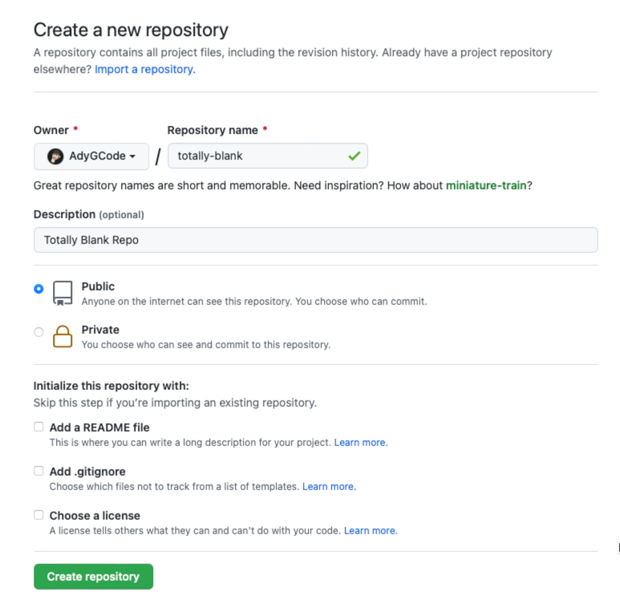
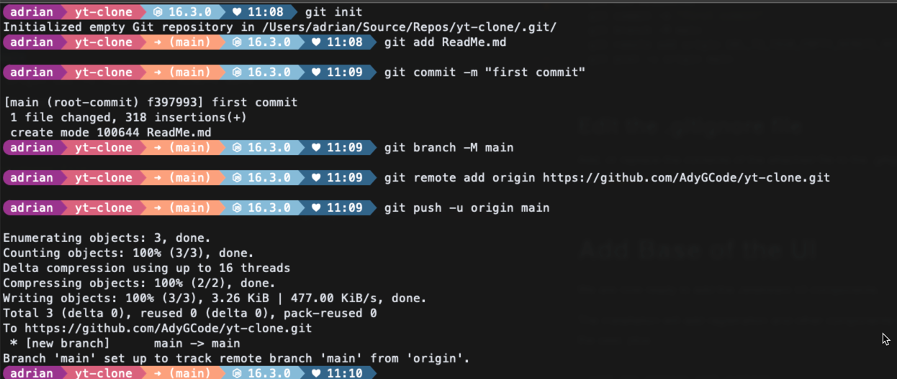
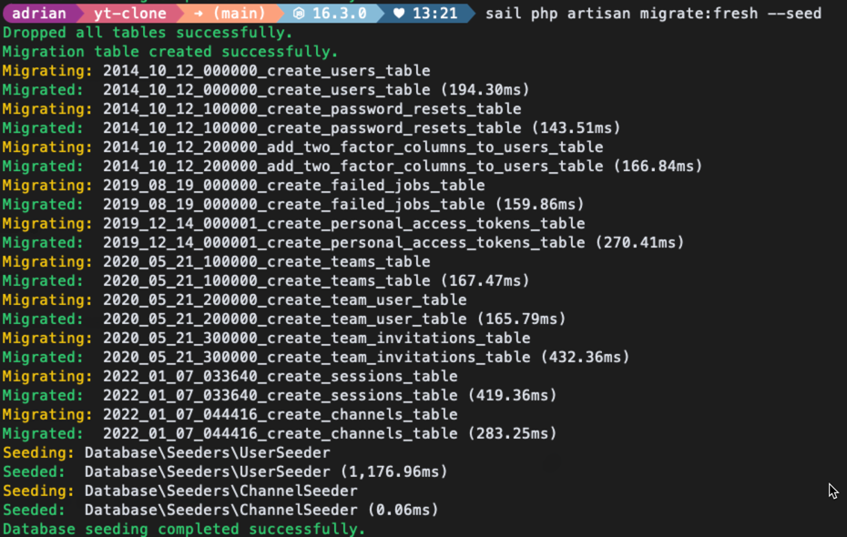
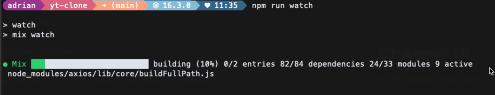
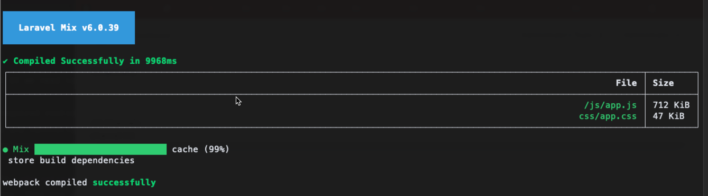
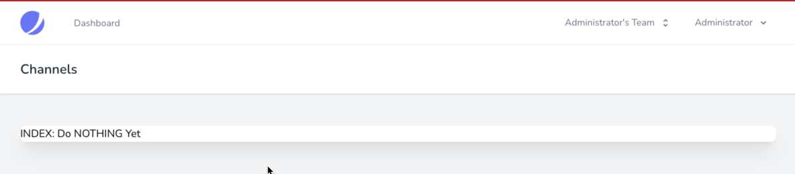
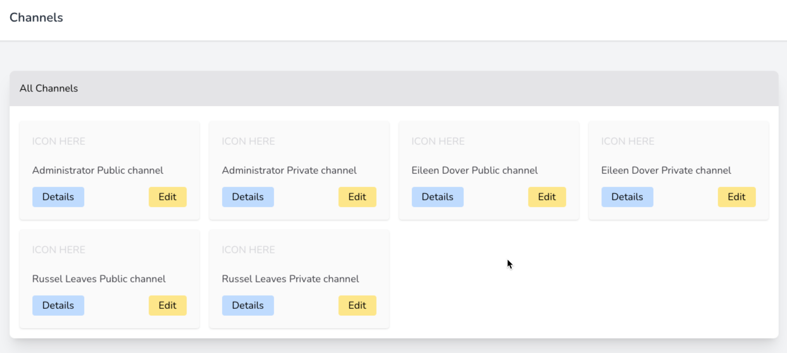

# n-Tube Type Clone

**This is a work in progress (WIP) and will regularly be updated.**

This document has the command "sail" used heavily. This is because
development was completed using a Docker based dev environment that is
part of the Laravel installation. This may be omitted if you are not
using Docker in your development process.

---

# Create new app

For all commands where `xxx` is shown, replace with your initials.

```bash
curl -s https://laravel.build/xxx-yt-clone | bash 
cd xxx-yt-clone 
sail up
```

---

# Initialise Version Control

We do this in two steps:

1. Create remote repository on GitHub or similar
2. Initialise the local repository, add and commit the ReadMe (this
   file), set the origin and then push to the remote we created.

## Create Remote Repository

Open the [GitHub website](http://github.com) and log into your account.

In the account create a new repository, but ensure the following:

- Do NOT add a readme or .gitignore or other files
- Make the project private if required
- Give the repository a suitable name (I used `totally-blank` in the
  demo image)

Keep the browser open as you are then able to copy the URL and commands
as needed.



### Terminal time

Open a terminal so that we may initialise the Repository.

> We usually need TWO terminals when developing, so if you have one
> open, open a new one and make sure you are in your xxx-yt-clone folder
> before continuing.

Then run the following command sequence.

```bash
git init
git add ReadMe.md
git commit -m "Initial commit to start repository"
git branch -M main
git remote add origin URL_TO_YOUR_EMPTY_REMOTE_REPO
git push -u origin main
```



## Updating and Committing the .gitignore

Add, or replace the contents of the attached file to the .gitignore
file: [.gitignore](.gitignore)

```bash
git add .gitignore
git commit -m "Update the .gitignore to remove unwanted files"
git push -u origin main
```

---

# Add UI Skeleton Code

We are now ready to add the Jetstream UI components...

The installation will add registration and other components for the
user, plus...

```bash
sail php artisan sail:publish
sail composer require laravel/jetstream
sail php artisan jetstream:install livewire --teams 

sail npm install 
sail npm run dev
sail php artisan migrate:fresh --seed
sail php artisan vendor:publish --tag=laravel-mail --tag=laravel-errors 
sail php artisan vendor:publish --tag=sail --tag=jetstream-views --tag=livewire 
sail php artisan vendor:publish --tag=livewire:assets --tag=livewire:config 
sail php artisan vendor:publish --tag=livewire:pagination --tag=sanctum-config
```

These commands add Laravel Livewire, and then publish the components and
some configuration files so that you can directly access and edit or
customise as required.

## IDE Helpers

Now to add a couple of helpers for PhpStorm (possibly other IDEs)...

```bash
sail composer require --dev barryvdh/laravel-ide-helper 
sail php artisan clear-compiled
sail php artisan ide-helper:generate
sail php artisan ide-helper:models -W
sail php artisan ide-helper:meta
```

Open the `composer.json` file, and add/modify an entry to the `scripts`
area. If the post-update-cmd is already present then add the lines
between the `[`square brackets`]`.

```json
  "post-update-cmd": [
"Illuminate\\Foundation\\ComposerScripts::postUpdate",
"@php artisan vendor:publish --tag=laravel-assets --ansi --force",
"@php artisan ide-helper:generate",
"@php artisan ide-helper:models -W",
"@php artisan ide-helper:meta"
],
```

### Do a Commit and Push to Version Control

Do the usual sequence of adding and pushing to verison control, with a
suitable comment:

```bash
git add .
git commit -m "Default configuration without seed users"
git push -u origin main
```

---

# Create Model for Channel

This command also creates a migration, factory, seeder, controller and
policy for the Channels.

```bash
sail php artisan make:model Channel -a -r
```

Go to the `database/migrations` folder and open the file that
contains `create_channels_table.php` in its filename.

Modify/Add the following code:

```PHP
Schema::create('channels', function (Blueprint $table) {
    $table->id();
    $table->unsignedBigInteger('user_id');
    $table->string('name');
    $table->string('slug');
    $table->boolean('private')->default(false);
    $table->string('uid');
    $table->text('description')->nullable();
    $table->string('image')->nullable();
    $table->timestamps();

    $table->foreign('user_id')->references('id')
        ->on('users')->oncascade('delete');
});
```

Now open the model file for the channel, `Channel.php` that is in
the `app/Models` folder.

Edit it to define the editable fields, and also the relationship between
channel and user.

Add the following code inside the class definition, and after
the `use HasFactory;` line:

```php
    protected $fillable = [
        'name',
        'description',
        'image',
        'public',
        'slug',
        'uid',
        'user_id',
    ];

    /**
     * A channel BELONGS TO a user.
     *
     * @return \Illuminate\Database\Eloquent\Relations\HasMany
     */
    public function user()
    {
        return $this->belongsTo(User::class);
    }
```

Edit the `User.php` file from the same folder and add the following
relationship definition within the class, and after the `$casts`
definition:

```php
    /**
     * A user has MANY channels
     *
     * @return \Illuminate\Database\Eloquent\Relations\HasMany
     */
    public function channels(){
        return $this->hasMany(Channel::class);
    }
```

Now run the migration again:

```bash
sail php artisan migrate:fresh --seed
```

When a user registers, we want the application to automatically create
them a channel based around the user's name and add 'channel' to the
end.

The channel name will be similar to this: `Eileen Dover Public Channel`.

It will have a 'slug' that will be similar to
`eileen-dover-public-channel`.

This slug will be used to identify the required channel when using a URL
similar to
`http://yt-clone.com/channels/eileen-dover-public-channel`.

To get the slug to be used for 'routing' we need to edit the Channel
model and add the following before the `public function user` line:

```php
    /**
     * Provides the key name for the routes to be the slug in place of the commonly used 'id'.
     *
     * @return string
     */
    public function getRouteKeyName()
    {
        return 'slug';
    }
```

## Time to commit to this

OK, we have made some large changes in the code, so we will commit them
to version control.

Perform the usual steps:

- add files to the staging area
- check the status of files in the staging area
- commit the changes to the repository
- push the changes to the remote repository

```bash
git add .
git status
git commit -m "Base application plus Channel model and migration"
git push origin main
```

---

# Add Seeder Data

To enable interactive testing, we will add some seed data that we can
repeatedly use.

## User Seeder

Run the command:

```bash
sail php artisan make:seeder UserSeeder
```

Now find and open the new file in the `database/seeders` folder.

In the run method we are going to do two things:

1. Add required 'uses' statements
2. Create a list of known seed users,
3. Create the new user.
4. Create public and private channels for each user.
5. Create a 'team' for each user.

### Include Required Classes

Before we add the users, we will add the required `uses` statements:

```php
use App\Models\Channel;
use App\Models\User;
use Illuminate\Database\Seeder;
use Illuminate\Support\Facades\Hash;
use App\Models\Team;
use Str;
```

We will be making use of these when we seed.

### Define Users

The seed users are:

```text
|---------------|--------------------|-----------|
| User Name     | eMail              |Password   |
|---------------|--------------------|-----------|
| Administrator | admin@example.com  | Password1 |
| Eileen Dover  | eileen@example.com | Password1 |
| Russel Leaves | russel@example.com | Password1 |
|---------------|--------------------|-----------|
```

These are added to an array containing an associative array for each
user. The PHP to do this is shown below, and you should add it to the
run method:

```php
$seedUsers = [
            [
            'name'=>'Administrator',
            'email'=>'admin@example.com',
            'password'=>Hash::make('Password1'),
                ],
            [
            'name'=>'Eileen Dover',
            'email'=>'eileen@example.com',
            'password'=>Hash::make('Password1'),
                ],
            [
            'name'=>'Russel Leaves',
            'email'=>'russel@example.com',
            'password'=>Hash::make('Password1'),
                ],
        ];
```

### Seeding Loop

Next we will create the loop that adds each new user, plus creates the
channel:

```php
foreach ($seedUsers as $seedUser) {
    $user = User::create($seedUser);
    $team = $this->createTeam($user);
    foreach (['Public', 'Private'] as $pubOrPrivate) {
        $channelName = implode([$user->name, " ", $pubOrPrivate," channel"]);
        $userChannel = [
            'user_id' => $user->id,
            'name' => $channelName,
            'slug' => Str::slug($channelName, '-'),
            'public'=> $pubOrPrivate==='Public',
            'uid' => uniqid(true, true),
            'description' => null,
            'image' => null,
        ];
        Channel::create($userChannel);
    }
}
```

### Create Team method

After the seeding loop and just before the closing `}` curly bracket of
the class we will add the following code, which creates a new personal
team for the user.

> We may or may not use teams later in the project.

```php
/**
 * Create a personal team for the user.
 *
 * Taken from the CreateNewUser class and reproduced for simplicity.
 *
 * @param  \App\Models\User  $user
 * @return void
 */
protected function createTeam(User $user)
{
    $user->ownedTeams()->save(
        Team::forceCreate([
              'user_id' => $user->id,
              'name' => explode(' ', $user->name, 2)[0]."'s Team",
              'personal_team' => true,
          ])
    );
}
```

## Channel Seeder

We do not have any seeding to be added at this time to the channels.

## Add Seeder Calls

Open the `DatabaseSeeder.php` file and modify the code so that it runs
the required seeders in turn, starting with User.

The run method becomes:

```php
public function run()
{
    // \App\Models\User::factory(10)->create();
    $this->call([
        UserSeeder::class,
        ChannelSeeder::class,
                ]);
}
```

## Re-Run the Migrations

Now re-run the migration using:

```bash
sail php artisan migrate:fresh --seed
```



### Add, Commit, Push

Let's add the new code to version control.

```bash
git add .
git status
git commit -m "Base application plus Channel model and migration"
git push origin main
```

---

# Channel UI

For the channel UI we need to:

1. Create the required routing.
2. Create views and controller methods for Add, Edit, Browse and Read.
3. Add remaining methods to Store, Update and Destroy channels.

When we used the `php artisan make:model` command we listed `-a` and
`-r` as arguments. This has automatically created the channel controller
for us, and all we will need to do is now add the required code to
perform the actions.

Because TailwindCSS version 3 now uses a different way of working we
will need to run a command in the CLI to watch the project and
automatically update the required files - that is the JS and CSS files.

If you do not have a spare CLI then open up a window, change into the
correct folder, and run:

```bash
npm run watch
```

Leave this running whilst you are working.



When a change is detected it will 'compile' the code, and generate new
files. Success is shown below:



## Adding Routes for Channels

Open the `web.php` file from the `routes` folder.

Modify it by grouping the "authenticated" routes by adding and modifying
the following route. In this you will note that we move the dashboard
route into the group, and update it to remove the middleware call.

```php
Route::middleware(['auth:sanctum', 'verified'])->group(function () {
    Route::get('/dashboard', function () {
        return view('dashboard');
    })->name('dashboard');
    
    Route::resource('/channels', \App\Http\Controllers\ChannelController::class);
    
});
```

The middleware is how Laravel checks for authentication, and other
possible actions.

> **ASIDE:** When adding routes, it is a good idea to keep them in
> alphabetical order as it makes it easier to locate them. Also,
> group your authenticated and other types of route together as well.
> Any actions likes this will help you to improve productivity.

## View Location

Views are contained in the `resources/views` folder.

We place the views for model that requires them, into a folder in this
location.

## Channels Index

To provide us with the first part of our layout, we will create an index
page for the channels, but we will make it display all channels, both
public and private.

At a later time we will make it show just the public channels and the
private channels owned by the user.

Create a new folder inside `resources/views` called `channels`.

Then create ale called `index.blade.php` inside the
`resources/views/channels` folder.

> **SHORTCUT :** We can create the folder and the file in one step
> by first clicking on the `views` folder, then using the sequence,
> `File -> New -> PHP File`, then entering `channels/index.blade.php`

The file will be blank, so we need to add code to make it do something.

In the new file we will add code based on the 'dashboard', to make it
look similar to the current layout.

```php
<x-app-layout>
    <x-slot name="header">
        <h2 class="font-semibold text-xl text-gray-800 leading-tight">
            {{ __('Channels') }}
        </h2>
    </x-slot>

    <div class="py-12">
        <div class="max-w-7xl mx-auto sm:px-6 lg:px-8">
            <div class="bg-white overflow-hidden shadow-xl sm:rounded-lg">

                <h1>INDEX: Do NOTHING Yet</h1>

            </div>
        </div>
    </div>
</x-app-layout>
```

The `x-app-layout` tells Laravel to use the layouts/app.blade.php file
as the base for this page, and then insert content as needed.

Open the browser, open the site (http://localhost for sail users), and
then log-in using the administrator user.

Next, once the user is logged in, edit the URL to be
`http://localhost/channels/` and you should see:



Next we will list the channels by editing this view, concentrating on
the part after the `All Channels`:

```php
<div class="container mx-auto grid lg:grid-cols-3 xl:grid-cols-4 p-4 gap-4">

    @foreach($channels as $channel)
        <div class="rounded border-1 shadow">
            <div class="p-4 sm:p-5">
                <p tabindex="0"
                   class="focus:outline-none text-base leading-5 pt-6 text-zinc-700">
                   {{$channel->name}}
                </p>
                <div class="flex items-center justify-between pt-4">
                    <a href="#" class="rounded p-1 px-4 bg-blue-200 hover:bg-blue-500"
                       role="button">
                       Details
                    </a>

                    <a href="#" class="rounded p-1 px-4 bg-amber-200 hover:bg-amber-500"
                       role="button">
                       Edit
                    </a>
                </div>
            </div>
        </div>
    @endforeach

</div>
```
You should get a list of the channels shown a little cards. It will 
appear slightly different to shown here:



We will modify the edit and details buttons later.

## Edit

Locate the `ChannelsController` in the `app/Http/Controllers` folder,
and open it for editing.

In this file you will find stub methods ready for you to use, such as
the one below:

```php
/**
 * Display a listing of the resource.
 *
 * @return \Illuminate\Http\Response
 */
public function index()
{
    //
}
```

Locate the `edit` method and modify to become:

```php
public function edit(Channel $channel)
{
    return view('channels.edit', compact(['channel']));
}
```

This method will open the channels/edit view
(`resources/views/channels/edit.blade.php`) sending the channel details
to the view for display. 

